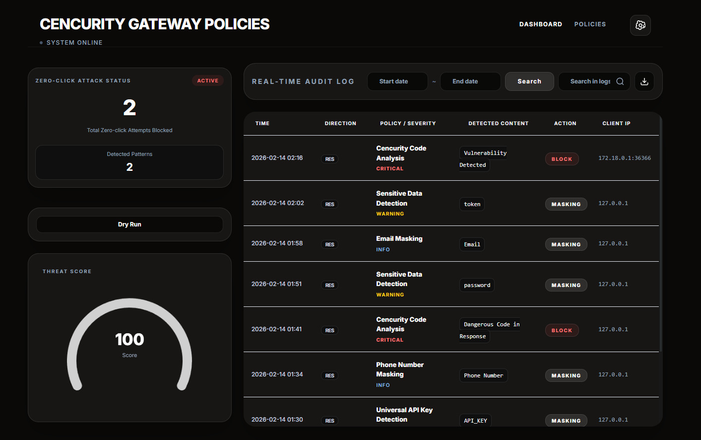



# Cencurity Community (Public Deploy)

Cencurity is a security gateway that proxies LLM/agent traffic and detects / masks / blocks sensitive data and risky code patterns in requests and responses, while recording everything as Audit Logs.

## Screenshots

### 1) Dashboard



What you see on this screen (as implemented in the UI):

- **Security score** computed from recent audit logs (severity-weighted).
- **Zero-click status** derived from code-analysis related audit-log entries.
- **Live updates**: the page loads recent logs from `GET /api/audit-logs` and then keeps updating via `GET /sse` (Server-Sent Events).

### 2) Log Analysis


This view is the audit-log table + detail drilldown:

- The table includes Time / Direction / Policy+Severity / Detected Content / Action / Client IP.
- Clicking a row opens a detail modal that renders **Finding Details** from the `finding_details` field (when present) and shows a sanitized captured payload.
- The dataset comes from the same audit-log pipeline used by the dashboard (`/api/audit-logs` + `/sse`).

### 3) Dry Run


Dry Run is a safe simulator:

- Simulator (no log writes): the modal calls `POST /api/dry-run` with `{ policy_id, input, direction }` and returns whether the input would be **masked**, **blocked**, or **left unchanged**.

Notes:

- The simulator explicitly does not write to `audit_logs`.
- For code-analysis policies, the simulator can evaluate inbound/outbound directions and may return a structured `finding` payload when a risky pattern is detected.

### 4) Zero-click


This GIF highlights how “zero-click” protection shows up in the product:

- **Inbound (agent/tool execution attempts)**: when requests contain `tools/call` payloads that include dangerous execution primitives (for example `os.system`, `subprocess`, `eval`, `exec`), Cencurity can block them and write an audit log under the unified **Cencurity Code Analysis** policy.
- **Outbound (dangerous code in model responses)**: when the upstream model response contains risky code (including code blocks in streaming SSE), Cencurity can block the response and emit a structured policy error payload.
- These events flow into the same pipeline the dashboard uses (`/api/audit-logs` + `/sse`), which is why the **Zero-click status** widget updates in real time.

## What Cencurity Does

- AI API Proxy: Proxies OpenAI-compatible endpoints (works with many LLM providers and self-hosted/open-source gateways that implement the OpenAI API), plus Anthropic- and Gemini-compatible endpoints.
- Policy-based masking: Applies Regex policies to replace sensitive data with `[MASKED]` (or a custom mask text) and records per-policy severity.
- Zero-click / Code-analysis blocking:
  - For inbound `tools/call` payloads, extracts arguments/code that could actually be executed.
  - Immediately blocks dangerous keywords like `os.system`, `subprocess`, `eval`, `exec`.
  - Can detect and block risky patterns using static analysis (SAST) rules.
- Streaming response protection: Even during SSE streaming, it can safely accumulate fenced code blocks (``` … ```) for scanning/blocking.
- Audit log storage & query: Stores policy match events (mask/block) in the DB and exposes recent logs via API.
- Real-time events (SSE): Broadcasts audit-log events in real time so the dashboard can update instantly.
- Dry Run:
  - Simulates “would this be masked/blocked?” without writing audit_logs.
- Webhook alerts: Sends Slack/Discord/Telegram/Jandi/Custom webhook alerts based on severity/events.

## Run

### 1) Clone

```bash
git clone https://github.com/cencurity/cencurity.git
cd cencurity
```

### 2) Configure

Copy `.env.example` to `.env`, then set `CENCURITY_IMAGE` to an image you have already built and published (Docker Hub / GHCR).

### 3) Deploy (Docker)

```bash
docker compose up -d
```

Data is persisted under `data/`.

### 4) URLs

- Dashboard: http://localhost:18080
- Proxy: http://localhost:18082

## Tenant (first run)

- On first start, a default tenant is auto-created: `customer`
- A bootstrap API key is generated and written to:
  - `data/bootstrap_tenant_customer_api_key.txt`
- Open the Dashboard and paste that API key when prompted.

## Dashboard Login (how it works)

The dashboard prompts for an API key on first access.


- Paste the key from `data/bootstrap_tenant_customer_api_key.txt` into the login modal.
- The UI validates the key by calling `GET /api/config` with both headers:
  - `Authorization: Bearer <YOUR_TENANT_API_KEY>`
  - `X-API-Key: <YOUR_TENANT_API_KEY>`
- On success, the key is stored in `localStorage` as `apiKey`, and subsequent dashboard requests attach it automatically.

## Using the Proxy

The proxy listens on http://localhost:18082 and exposes provider-compatible endpoints:

- OpenAI-compatible: `POST /v1/chat/completions` and `GET /v1/models`
- Anthropic-compatible: `POST /v1/messages`
- Gemini-compatible: `POST /v1beta/models/...`

### Authentication behavior (local community deploy)

By default, the proxy expects your upstream LLM provider key on the request (for example, an OpenAI API key). The single-tenant gateway injects the tenant context automatically.

### Example: OpenAI-compatible request

Use a model name that your upstream provider actually supports.

```bash
curl http://localhost:18082/v1/chat/completions \
  -H "Content-Type: application/json" \
  -H "Authorization: Bearer $OPENAI_API_KEY" \
  -d '{
    "model": "YOUR_MODEL",
    "messages": [{"role":"user","content":"Hello"}]
  }'
```

### Where to put the proxy URL in your client

If your IDE/agent tool supports a custom OpenAI-compatible base URL:

- Set the **Base URL** to `http://localhost:18082`
- Set the **API Key** to your upstream provider key (example: your OpenAI API key)

### Example: Anthropic-compatible request

```bash
curl http://localhost:18082/v1/messages \
  -H "Content-Type: application/json" \
  -H "X-API-Key: $ANTHROPIC_API_KEY" \
  -H "anthropic-version: 2023-06-01" \
  -d '{
    "model": "YOUR_MODEL",
    "max_tokens": 256,
    "messages": [{"role":"user","content":"Hello"}]
  }'
```

## Notes

- This public deploy runs in `CENCURITY_MODE=customer`, and the admin server/UI is not started or exposed.

Tech stack: Go backend + React (Vite) dashboard + Nginx gateway + SQLite (via Docker Compose).
Or even shorter: Built with Go + React, shipped via Docker.


## Open Source Availability

This repository provides the public deployable community edition of Cencurity.
It allows developers to run the full security gateway locally using Docker.

Core components may be released progressively.
