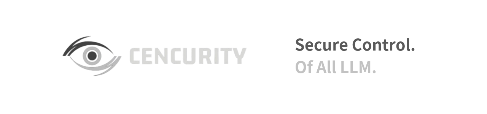



# Cencurity

Real-time security for AI-generated code inside VS Code.

## The problem

AI coding tools generate code instantly.

But security checks happen too late — during review or after execution.

This creates a blind spot where insecure code can slip through unnoticed.

---

## What Cencurity does

Cencurity sits between your IDE and the model.

It inspects generated code in real-time and blocks unsafe patterns before they reach your system.

---

## What it does

- Opens the Cencurity Security Center inside VS Code.
- Routes supported LLM traffic through a local security gateway.
- Inspects requests and responses against configurable security policies.
- Blocks unsafe code patterns and masks sensitive data in real time.
- Logs only policy violations, blocks, and masking events — normal traffic is never stored.
- Keeps your existing provider API key where it already lives.
- Supports multiple AI agents: **Roo Code**, **Continue**, and **Claude Code**.
- Auto-installs and configures the selected agent if it is not already present.
- Applies local security scanning before LLM responses reach your editor.

## Quickstart

1. Install the extension from the [VS Code Marketplace](https://marketplace.visualstudio.com/items?itemName=cencurity-labs.cencurity-vscode).
2. Open Command Palette `Ctrl+Shift+P` or `Command+Shift+P` (macOS) and run `Cencurity: Enable Protection`.
3. Select your LLM provider and enter your provider URL (for example `https://api.x.ai`).
4. Select which agent to route through the proxy: **Roo Code**, **Continue**, or **Claude Code**.
5. If the selected agent is not installed, Cencurity will install it automatically.
6. Open Command Palette again and run `Cencurity: Open Security Center`.

That's it — protection is now active. Cencurity routes traffic through a local gateway and applies security scanning before responses reach your selected agent.

> **Note:** Gemini CLI is also supported when using a Gemini provider. GitHub Copilot traffic is not supported.

---

## Features

### Security Event Dashboard

- View policy violations, blocks, and masking events in real time
- See exactly what was detected, which policy triggered, and what action was taken
- Normal requests are not logged — only security-relevant events appear

---

### Dry Run Mode

- Simulate execution without risk
- Understand behavior before anything runs

---

### Zero-click Attack Detection

- Detect dangerous patterns instantly
- Block risky operations like `subprocess`, shell execution, and similar unsafe flows

## Command Palette

Search for `cencurity` in the VS Code Command Palette to access the main actions:

- `Cencurity: Open Security Center` — open the Security Center dashboard inside VS Code
- `Cencurity: Enable Protection` — turn protection on and select your LLM provider
- `Cencurity: Disable Protection` — turn protection off and restore previous supported routing settings
- `Cencurity: Test Protection` — verify that requests are reaching the local proxy
- `Cencurity: Show Runtime Info` — inspect the local runtime and protection state
- `Cencurity: Install or Update Core` — install or refresh the local core runtime

## Supported agents

| Agent | Type | Auto-install | Provider compatibility |
|-------|------|-------------|------------------------|
| **Roo Code** | VS Code Agent | Yes | All providers |
| **Continue** | VS Code Agent | Yes | All providers |
| **Claude Code** | CLI | Yes | All providers |
| **Gemini CLI** | CLI | Yes | Gemini provider only |

> **Other agents & CLIs:** Any tool that supports a custom API base URL (e.g. `OPENAI_API_BASE`, `apiBase` config, etc.) can work with Cencurity. Point it to `http://127.0.0.1:38180/v1` and set your API key — the proxy handles the rest. The agents listed above are auto-configured; unlisted tools require manual setup.

## Supported providers

- OpenAI
- Anthropic
- Gemini
- OpenRouter
- Other OpenAI-compatible LLMs

## How it works

IDE → Cencurity Security Gateway → LLM Provider

- Your API key stays in your IDE.
- Requests are routed through a local security gateway on `127.0.0.1:38180`.
- Responses are scanned locally against security policies before they reach your editor.
- Only policy violations are recorded — normal traffic passes through without logging.

## What is CAST?

CAST (Code-Aware Security Transformation) protects a moment that existing tools don't cover.

| Model | When it runs | Main job | Typical result |
|-------|-------------|----------|----------------|
| **CAST** | while the model is still writing code | stop unsafe output before it reaches the developer | `allow`, `redact`, `block` |
| SAST | after code already exists | scan code for vulnerabilities | findings after generation |
| DAST | against a running app | test runtime behavior | runtime issues after deployment or staging |
| IAST | inside an instrumented app | watch real execution paths | internal runtime findings |

The point is not that CAST replaces SAST.
The point is that CAST protects a different moment: **while code is being generated.**

Cencurity is the first tool built on CAST.

## Notes

- Automatic proxy setup currently targets **Roo Code**. If Roo Code is not installed, Cencurity will install it automatically and reload the window when needed.
- Routing applies to supported env-based routing paths. Some extensions may bypass VS Code environment settings.
- Only security events (policy violations, blocks, masking) are persisted. Normal request content is never stored.
- Public source exposure is intentionally minimized; older private runtime and embedded UI trees are not included here.
