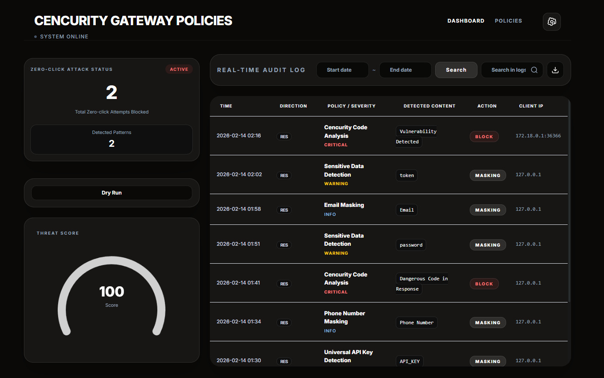

# Cencurity – Real-time security for AI-generated code

Stop insecure code from AI in real-time — before it runs.

## Quickstart

1. Install the extension  
2. Open Command Palette Ctrl+⇧Shift+P or ⌘Command+⇧Shift+P (macOS) `Cencurity Connector: Enable Protection`  
3. Select your LLM provider  
4. Open Command Palette Ctrl+⇧Shift+P or ⌘Command+⇧Shift+P (macOS) `Cencurity Connector: Open Security Center`  

That's it — protection is now active.

---

## The problem

AI coding tools generate code instantly.

But security checks happen too late — during review or after execution.

This creates a blind spot where insecure code can slip through unnoticed.

---

## What Cencurity does

Cencurity sits between your IDE and the model.

It inspects generated code in real-time and blocks unsafe patterns before they reach your system.

---

## Features

### Real-time Log Analysis

- Inspect generated code as it flows through the system
- See exactly what was detected and why

---

### Dry Run Mode

- Simulate execution without risk
- Understand behavior before anything runs

---

### Zero-click Attack Detection

- Detect dangerous patterns instantly
- Block risky operations like `subprocess`, shell execution, etc.

---

## Command Palette

Search for `cencurity` in the VS Code Command Palette to access the main actions:

- `Cencurity Connector: Open Security Center` — open the Security Center dashboard inside VS Code
- `Cencurity Connector: Enable Protection` — turn protection on and select your LLM provider
- `Cencurity Connector: Disable Protection` — turn protection off and restore previous supported routing settings
- `Cencurity Connector: Test Protection` — verify that requests are reaching the local proxy
- `Cencurity Connector: Show Runtime Info` — inspect the local runtime and protection state
- `Cencurity Connector: Install or Update Core` — install or refresh the local core runtime

---

## How it works

IDE → Cencurity Proxy → LLM Provider

- Your API key stays in your IDE  
- Requests are routed through a local proxy  
- Code is analyzed in real-time before execution  

---

## Supported providers

- OpenAI  
- Anthropic  
- Gemini  
- OpenRouter  

---

## Limitations

Some extensions may bypass VS Code environment settings and not route through the proxy.

---

## Feedback

Looking for feedback from developers using AI coding tools.

If you have thoughts or run into issues, feel free to open an issue or reach out.
